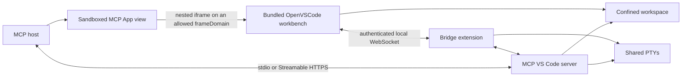

# MCP VS Code

MCP VS Code embeds a self-hosted Code OSS/OpenVSCode workbench inside an MCP App. The model and the human operate the same workspace, open editors, diagnostics, commands, and terminal sessions in real time.

This is not remote control of a separately installed VS Code. The standalone distribution contains the editor server, Node.js runtime, MCP server, bridge extension, and web UI. Microsoft-hosted `vscode.dev` is not used because it disallows framing.

> **Project status:** functional v0.1 implementation. Prerequisite-free releases target Windows x64, Linux x64, and Linux ARM64. Linux packages use verified upstream OpenVSCode archives; the Windows package is built in Windows CI from the pinned OpenVSCode source commit and exercised against the real workbench and bridge.

## How it works



The OpenVSCode process binds only to loopback. A gateway exposes it under a random, high-entropy path, avoiding third-party-cookie authentication inside the MCP sandbox. Remote MCP deployments must use TLS and bearer authentication.

## Capabilities

- Self-hosted Code OSS workbench rendered inside the MCP App sandbox.
- Human editing, navigation, source control, commands, extensions, and terminal interaction.
- Live editor state, selections, dirty buffers, diagnostics, and file changes visible to MCP tools.
- Shared terminal sessions using the target-native PTY bundled with OpenVSCode, with a pipe-based fallback.
- Workspace confinement with traversal and symlink-escape protection.
- Conflict-safe file writes using SHA-256 version tokens.
- stdio and Streamable HTTP/HTTPS transports from the same executable.
- Generic `vscode_execute_command` escape hatch for every command registered in the live workbench.

The server currently exposes 27 tools across these groups:

| Group | Tools |
| --- | --- |
| App/session | `vscode_open`, `workspace_status` |
| Files | `fs_list`, `fs_read`, `fs_write`, `fs_delete`, `fs_move`, `fs_search` |
| Editor | `editor_open`, `editor_state`, `editor_set_selection`, `editor_apply_edits` |
| Language services | `diagnostics_get` |
| Commands | `vscode_list_commands`, `vscode_execute_command` |
| Extensions | `extensions_list`, `extensions_install`, `extensions_uninstall` |
| Terminals | `terminal_create`, `terminal_list`, `terminal_read`, `terminal_write`, `terminal_resize`, `terminal_kill` |
| Git | `git_status`, `git_diff`, `git_run` |

Destructive and open-world tools are annotated accordingly so compatible MCP hosts can apply their approval policy.

## Install a standalone release

Download and extract the release archive for your platform.

Windows x64:

```powershell
.\bin\mcp-vscode.cmd --stdio --workspace C:\path\to\repository
```

Linux x64 or ARM64:

```bash
./bin/mcp-vscode --stdio --workspace /absolute/path/to/repository
```

The archive contains its own Node.js and OpenVSCode runtimes. It does not require VS Code, Node.js, Docker, or a system-wide package installation.

## Run from npm

With Node.js 22 or newer, `npx` starts the bundled stdio server on Windows x64, Linux x64, and Linux ARM64:

```powershell
npx -y @mario.andreschak/mcp-vscode@0.1.7 --stdio --workspace "C:\path\to\repository"
```

```bash
npx -y @mario.andreschak/mcp-vscode@0.1.7 --stdio --workspace "/path/to/repository"
```

For MCP clients that configure the workspace through an environment variable:

```json
{
  "mcpServers": {
    "vscode": {
      "command": "npx",
      "args": ["-y", "@mario.andreschak/mcp-vscode@0.1.7", "--stdio"],
      "env": {
        "MCP_VSCODE_WORKSPACE": "C:\\path\\to\\repository"
      }
    }
  }
}
```

`@mario.andreschak/mcp-vscode` itself contains no editor runtime. It declares one `optionalDependencies` entry per supported platform — `@mario.andreschak/mcp-vscode-win32-x64`, `-linux-x64`, and `-linux-arm64` — each gated by `os`/`cpu`, so npm downloads only the OpenVSCode runtime matching the host. macOS is not supported: upstream publishes no darwin server build.

Example MCP client configuration:

```json
{
  "mcpServers": {
    "vscode": {
      "command": "/opt/mcp-vscode/bin/mcp-vscode",
      "args": ["--stdio", "--workspace", "/work/my-repository"]
    }
  }
}
```

Calling `vscode_open` renders the workbench. The app requests fullscreen mode when the user selects **Fullscreen**.

## Run over HTTPS

```bash
./bin/mcp-vscode \
  --http \
  --https \
  --host 0.0.0.0 \
  --port 8443 \
  --workspace /work/my-repository \
  --public-url https://editor.example.com:8443 \
  --auth-token "$MCP_VSCODE_TOKEN" \
  --cert /run/secrets/tls.crt \
  --key /run/secrets/tls.key
```

The MCP endpoint is `https://editor.example.com:8443/mcp`. Binding beyond loopback is rejected unless both TLS and a bearer token are configured.

## MCP host requirements

The host must support the stable MCP Apps extension `io.modelcontextprotocol/ui` and:

- `text/html;profile=mcp-app` resources;
- the declared `frameDomains`, `connectDomains`, and `resourceDomains`;
- nested iframe scripts, workers, WebSockets, and same-origin behavior;
- a sufficiently large inline container or fullscreen display mode.

If a host blocks the OpenVSCode frame, the app displays the exact runtime or policy error instead of silently opening an external browser tab.

## Build from source

Requirements for development only: Node.js 22+.

```bash
npm ci
npm run check
```

Useful commands:

```bash
npm run dev -- --http --port 3001 --workspace . --ide-url http://127.0.0.1:3999
npm run dev:mock-ide -- --port 3999
npm run runtime:fetch -- linux-x64
npm run runtime:build -- win32-x64
npm run package:standalone -- linux-x64
npm run package:standalone -- win32-x64
npm run npm:platform-package -- linux-x64
```

`npm run npm:platform-package -- <target>` stages the publishable runtime package for one platform in `platform-packages/<target>/`, using whichever runtime is currently installed in `runtime/`. It refuses to run when `runtime/openvscode-runtime.json` reports a different target, so a Linux runtime can never be published under the Windows package. `npm run npm:prepare-manifest` stages the platform-neutral dispatcher manifest that pins those packages, and `npm run npm:verify-runtime` asserts the dispatcher stays free of `os`/`cpu` gates and of the bundled `runtime` directory.

The runtime fetcher pins OpenVSCode `1.109.5` and verifies upstream Linux SHA-256 digests before extraction. Native Windows builds pin and verify upstream commit `4ffe2270acdf711bbefecc3e8c79f4b3631640e5`, then invoke Code OSS's `vscode-reh-web-win32-x64` build target. Building that runtime locally requires Windows x64, Git, Node.js 22.21.1 or newer, and the Visual Studio 2022 C++ build tools with `Microsoft.VisualStudio.Component.VC.Runtimes.x86.x64.Spectre`. Release archives contain the resulting runtime and do not require those development tools. Runtime and standalone output directories are ignored by Git.

## Publish a release to npm

Release CI publishes automatically once the `NPM_TOKEN` secret and the `npm-publish` environment are configured. To publish by hand instead — for example when the account requires an interactive passkey — download the `*.npm.tgz` assets and their `.sha256` sidecars from the GitHub Release into `release-artifacts-v<version>/`, then run:

```bash
npm run npm:publish -- release-artifacts-v0.1.7 --dry-run   # verify only, upload nothing
npm run npm:publish -- release-artifacts-v0.1.7             # publish
```

Authentication happens in a **second terminal**, because passkey sign-in opens a browser and blocks:

```bash
npm run npm:login     # browser opens for passkey / WebAuthn
npm run npm:whoami    # confirm the identity
```

`npm run npm:publish` verifies every tarball before asking for credentials, then waits for that login to land and continues on its own, so both terminals can be driven side by side. It publishes the three runtime packages before the dispatcher that pins them, skips versions already on the registry so an interrupted run can simply be re-run, and refuses to upload a tarball whose internal `package.json` disagrees with the name and version its filename claims. It never builds a tarball: the published bytes are exactly the audited release artifacts.

## Security model

- Every file path is resolved beneath one configured workspace root. Existing symlinks are canonicalized before access.
- The workspace root cannot be deleted through MCP tools.
- OpenVSCode listens on loopback and is exposed through an unguessable per-process path.
- The bridge uses a separate 256-bit token and accepts one active bridge connection.
- Remote listeners require HTTPS and bearer authentication.
- Git hooks are disabled for `git_run`; arbitrary VS Code commands and shell input remain powerful and should require host approval.
- Unsaved text documents up to 2 MB are mirrored into the MCP-visible overlay. Larger dirty documents remain available through editor commands but are not copied on every keystroke.

See [SECURITY.md](SECURITY.md) for reporting and deployment guidance.

## Upstream and trademarks

OpenVSCode Server and Code OSS are MIT-licensed upstream projects. MCP VS Code is independent and is not affiliated with or endorsed by Microsoft or Gitpod. “Visual Studio Code” and “VS Code” are trademarks of Microsoft Corporation.

## License

MIT. See [LICENSE](LICENSE) and [THIRD_PARTY_NOTICES.md](THIRD_PARTY_NOTICES.md).
