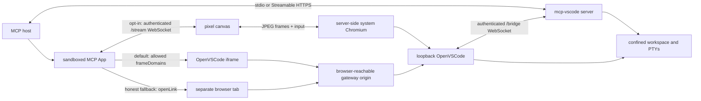

# MCP VS Code

MCP VS Code runs a self-hosted Code OSS/OpenVSCode workbench beside an MCP server so the human and the model operate the same workspace, open editors, diagnostics, commands, extensions, and terminal sessions.

> **No-facsimile guarantee:** every editor UI shown by this project is the genuine OpenVSCode workbench. The MCP App never replaces it with a hand-built editor or terminal while continuing to call the result VS Code. If the real workbench cannot be displayed, the App says so and offers the same workbench in a browser when a reachable URL exists.

This is not remote control of a separately installed desktop VS Code. Supported distributions carry their own OpenVSCode runtime and bridge extension. Microsoft-hosted `vscode.dev` is not used because it disallows framing.

> **Project status:** functional v0.2 implementation. Default releases target Windows x64, Linux x64, and Linux ARM64. macOS is not supported because upstream publishes no OpenVSCode Server runtime for Darwin.

## The caveman picture

There are four pieces:

1. The **MCP host**—for example FLUJO or Claude Desktop—owns the outer sandbox and its security policy.
2. The small **MCP App document** asks the host for permission to reach and, in default mode, frame the workbench origin.
3. The **mcp-vscode gateway** exposes only the routes needed to reach the private runtime.
4. The **OpenVSCode process** runs on the MCP server machine, binds to loopback, opens the configured workspace, and connects its bridge extension back to the MCP server.



The default iframe and browser-tab paths deliver OpenVSCode directly. Experimental streaming launches an existing Edge, Chrome, or Chromium on the server, points it at that same OpenVSCode runtime, and transports its pixels and user input. The canvas is a remote display, not another editor implementation.

## Rendering modes

| Mode | Selection | Required host capability | What the user sees |
| --- | --- | --- | --- |
| `embedded` | Default when the host approves the declared workbench origin and the liveness probe succeeds | `frameDomains` for the nested document | Genuine OpenVSCode inside the MCP App |
| `stream` | Only when `MCP_VSCODE_RENDER_MODE=stream` | A reachable WebSocket allowed by `connectDomains`; no nested-frame grant | Genuine OpenVSCode rendered by server-side Chromium and drawn as pixels in the MCP App |
| `browser` | Honest fallback when the requested inline mode is denied, unreachable, or unavailable | Host-supported `openLink`, or a normal link in the debug page | The same genuine OpenVSCode workbench in a separate tab |

`probing` is a temporary UI state, not a renderer.

### Default behavior: iframe or browser

With no render-mode environment variable, the App:

1. waits for the bundled OpenVSCode runtime;
2. compares the workbench origin with the effective `frameDomains` reported by the host when that information is available;
3. skips iframe navigation immediately when the host explicitly denied the origin;
4. otherwise navigates the iframe and waits for the injected `mcp-vscode:workbench-alive` message;
5. commits `embedded` only after that positive signal; or
6. shows the `browser` card with the exact policy, network, or runtime reason.

A CSP-blocked iframe can emit neither a useful `load` nor `error` event, so a plain iframe event is not treated as success. The liveness timeout prevents a permanent blank view.

An MCP server's CSP declaration is a permission request, not a way to overrule the host. A host may approve it, restrict it, or deny it. CORS headers on mcp-vscode cannot repair a `frame-src` decision made by the outer host.

### Experimental streaming

Set:

```text
MCP_VSCODE_RENDER_MODE=stream
```

Streaming deliberately replaces the iframe decision for that process; it is not an automatic fallback. If streaming cannot start, the App reports the failure and moves to the honest browser option rather than silently selecting a different editor.

The server:

- discovers an existing Microsoft Edge, Google Chrome, or Chromium installation, or uses `MCP_VSCODE_STREAM_BROWSER`;
- launches it headlessly with a dedicated ephemeral user-data directory;
- when the POSIX server runs as root with Chromium's sandbox enabled, reads the fixed `node` account from `/etc/passwd`, transfers ownership of that private profile, and drops only the Chromium child to its non-zero uid/gid;
- points Chromium's working directory, `HOME`, `TMPDIR`, and XDG directories into that same ephemeral profile instead of inheriting the server account's paths;
- binds its Chrome DevTools Protocol listener to `127.0.0.1` only;
- navigates to a server-selected internal OpenVSCode URL—the App cannot navigate Chromium or issue arbitrary DevTools commands;
- emits JPEG screencast frames at up to 12 frames per second;
- accepts bounded resize, pointer, wheel, keyboard, and text-input messages; and
- permits one active viewer.

The `/stream` WebSocket uses its own random 256-bit bearer token. Both the tokenized stream URL and the high-entropy `/ide/<key>` URL are excluded from model-visible tool text and `structuredContent`; they are delivered to the MCP App through tool-result `_meta` only. Logs do not contain the stream token.

Streaming is useful when a host grants `connectDomains` but refuses `frameDomains`, which is the behavior observed with locally configured Claude Desktop stdio connectors in the test documented in [the upstream report draft](docs/upstream-frame-domains-report.md).

Streaming remains experimental:

- JPEG frames consume more CPU and bandwidth and feel less immediate than a direct iframe.
- There is no audio and only one viewer.
- Basic mouse, keyboard, wheel, and paste input work; clipboard copy and complex IME composition are incomplete.
- A system Chromium-family browser is an additional prerequisite. The project does not download or bundle one for this mode.
- The gateway WebSocket must be browser-reachable. Streaming does not make a private Fly Machine port magically reachable.

### Failure means failure

All three displayed outcomes refer to the real OpenVSCode runtime. If that runtime is missing or failed, there is no editor UI to show. File, Git, and terminal MCP tools may still operate where applicable, but editor/diagnostics/command/extension tools that require the live bridge fail explicitly.

There is no special macOS editor fallback: without an OpenVSCode Server runtime, neither embedding, streaming, nor the external-browser view can provide the workbench.

## Configuration

### User-facing environment variables

| Variable | Default | Purpose |
| --- | --- | --- |
| `MCP_VSCODE_WORKSPACE` | Process working directory | Absolute workspace root. Prefer setting this explicitly. `--workspace` takes precedence. |
| `MCP_VSCODE_OPENVSCODE_ROOT` | Platform runtime package or bundled runtime | Override the OpenVSCode runtime directory. `--openvscode-root` takes precedence. |
| `MCP_VSCODE_RENDER_MODE` | `default` | Set exactly `stream` to enable experimental genuine-workbench pixel streaming. `default`, empty, or unset uses iframe/browser behavior. Other values fail startup. |
| `MCP_VSCODE_STREAM_BROWSER` | Auto-discovery | Absolute path to Edge, Chrome, or Chromium for streaming. |
| `MCP_VSCODE_STREAM_NO_SANDBOX` | `0` | Set `1` or `true` only as an explicit last resort when a locked-down container cannot run Chromium's own sandbox. On POSIX, a root mcp-vscode process instead drops only Chromium to a safe `node` account by default. |

FLUJO-managed hosted children may also receive `FLUJO_MCP_APP_RUNTIME_REGISTER_URL` and `FLUJO_MCP_APP_RUNTIME_REGISTER_TOKEN`. Those are short-lived internal broker capabilities, not user settings. mcp-vscode proves possession, registers an allowlisted route manifest, clears both variables before OpenVSCode starts, and never exposes the bearer to the workbench.

### Claude Desktop example

Default mode honestly falls back to a browser when the tested Claude Desktop host declines the local loopback `frameDomains` request:

```json
{
  "mcpServers": {
    "vscode": {
      "command": "npx",
      "args": ["-y", "@mario.andreschak/mcp-vscode@0.2.2", "--stdio"],
      "env": {
        "MCP_VSCODE_WORKSPACE": "C:\\path\\to\\repository"
      }
    }
  }
}
```

To test genuine inline streaming instead:

```json
{
  "mcpServers": {
    "vscode": {
      "command": "npx",
      "args": ["-y", "@mario.andreschak/mcp-vscode@0.2.2", "--stdio"],
      "env": {
        "MCP_VSCODE_WORKSPACE": "C:\\path\\to\\repository",
        "MCP_VSCODE_RENDER_MODE": "stream",
        "MCP_VSCODE_STREAM_BROWSER": "C:\\Program Files (x86)\\Microsoft\\Edge\\Application\\msedge.exe"
      }
    }
  }
}
```

The browser-path override is optional when discovery finds an installed browser. Host behavior changes over time; re-run the [manual matrix](docs/manual-test-matrix.md) against the exact Claude Desktop version rather than treating the current observation as permanent.

## FLUJO and Fly.io deployment

A user can visit one human-facing site such as `try.flujo.com.co`, while the browser uses additional security origins behind the scenes. A sandboxed MCP App and its nested workbench cannot safely be collapsed into one literal browser origin merely to make deployment look simpler.

For a FLUJO-managed stdio child, the runtime-broker handshake solves the private-port problem:

1. FLUJO gives the child a one-use loopback registration capability.
2. mcp-vscode proves possession of that capability and registers only its random `/ide/<key>` prefix, including the workbench's HTTP and WebSocket traffic.
3. When streaming is enabled, it additionally registers only the exact `/stream` WebSocket route.
4. The broker returns a browser-reachable per-App HTTPS origin. mcp-vscode uses that origin in MCP App CSP metadata and App-only result metadata instead of advertising `127.0.0.1` to the visitor.
5. The external proxy keeps `/mcp`, `/bridge`, `/healthz`, `/app`, `/session.json`, and the temporary proof route private.

The hosted deployment still needs:

- wildcard DNS and TLS for its per-App origin scheme;
- HTTP and WebSocket proxying for the random OpenVSCode prefix;
- WebSocket proxying for `/stream` when experimental streaming is enabled;
- preserved `Upgrade`, `Host`, `Origin`, and `Referer` behavior expected by the sandbox and workbench; and
- a browser-reachable `https:` origin so the corresponding stream URL is `wss:`.

For streaming on Fly, install Edge, Chrome, or Chromium in the Machine image. Prefer running the whole container unprivileged. If FLUJO must run mcp-vscode as root, the image must contain exactly one `node` account with a non-zero uid and gid and a safe shared `/tmp` (root-owned, traversable, and sticky when group/world-writable); mcp-vscode creates the high-entropy profile under that ancestor, chowns only the profile, and spawns only the browser under `node` with the sandbox intact. Missing or unsafe account/temp-directory data produces a visible streaming-unavailable error. It never silently adds `--no-sandbox`. `MCP_VSCODE_STREAM_NO_SANDBOX=1` remains an explicit last-resort security tradeoff, not ordinary deployment configuration.

If mcp-vscode is deployed remotely without FLUJO's broker, `--public-url` must name an equivalent browser-reachable gateway origin and the reverse proxy must carry the same workbench HTTP/WebSocket and optional `/stream` WebSocket traffic. CORS settings alone cannot replace routing.

## Gateway HTTP surface

The local gateway serves:

| Route | Authentication/exposure | Purpose |
| --- | --- | --- |
| `GET /healthz` | Local deployment policy | Liveness and OpenVSCode/bridge state |
| `GET /session.json` | `?token=` when `--auth-token` is configured | Debug-browser session payload |
| `GET /app` | `?token=` when `--auth-token` is configured | Debug version of the MCP App document |
| `ALL /mcp` | `Authorization: Bearer` when configured | Streamable HTTP MCP transport |
| `HTTP/WS /ide/<random>/...` | High-entropy per-process path; narrowly brokered in FLUJO | Proxied genuine OpenVSCode workbench, assets, APIs, and sockets |
| `WS /bridge` | Authenticated bridge handshake | OpenVSCode bridge extension JSON-RPC channel; not brokered publicly by FLUJO |
| `WS /stream` | Independent token in query; one viewer; only when enabled | Experimental JPEG-frame and input channel |
| `GET /.well-known/flujo/mcp-app-runtime` | Temporary one-use FLUJO proof; then disabled | Hosted runtime registration only |

The brokered public origin exposes only the routes explicitly registered for the MCP App, not this entire local surface.

## Capabilities

- Genuine self-hosted Code OSS/OpenVSCode workbench.
- Human editing, navigation, source control, commands, extensions, webviews, and terminal interaction.
- Live editor state, selections, dirty buffers, diagnostics, and file changes visible to MCP tools through the OpenVSCode bridge.
- Shared terminal sessions using a target-native PTY where available, with a pipe-based fallback.
- Workspace confinement with traversal and symlink-escape protection.
- Conflict-safe file writes using SHA-256 version hashes.
- stdio and Streamable HTTP/HTTPS transports from the same executable.
- Generic `vscode_execute_command` escape hatch for commands registered in the live workbench.

The server exposes 27 tools across these groups:

| Group | Tools |
| --- | --- |
| App/session | `vscode_open`, `workspace_status` |
| Files | `fs_list`, `fs_read`, `fs_write`, `fs_delete`, `fs_move`, `fs_search` |
| Editor | `editor_open`, `editor_state`, `editor_set_selection`, `editor_apply_edits` |
| Language services | `diagnostics_get` |
| Commands | `vscode_list_commands`, `vscode_execute_command` |
| Extensions | `extensions_list`, `extensions_install`, `extensions_uninstall` |
| Terminals | `terminal_create`, `terminal_list`, `terminal_read`, `terminal_write`, `terminal_resize`, `terminal_kill` |
| Git | `git_status`, `git_diff`, `git_run` |

Editor, diagnostics, command, and extension tools always target the genuine OpenVSCode bridge. Destructive and open-world tools are annotated so compatible MCP hosts can apply their approval policy.

## Install a standalone release

Download and extract the release archive for your platform.

Windows x64:

```powershell
.\bin\mcp-vscode.cmd --stdio --workspace C:\path\to\repository
```

Linux x64 or ARM64:

```bash
./bin/mcp-vscode --stdio --workspace /absolute/path/to/repository
```

The archive contains its own Node.js and OpenVSCode runtimes. Default iframe/browser operation does not require VS Code, Node.js, Docker, or a system-wide package installation. Experimental streaming additionally requires an installed Chromium-family browser.

## Run from npm

With Node.js 22 or newer, `npx` starts the bundled stdio server on Windows x64, Linux x64, and Linux ARM64:

```powershell
npx -y @mario.andreschak/mcp-vscode@0.2.2 --stdio --workspace "C:\path\to\repository"
```

```bash
npx -y @mario.andreschak/mcp-vscode@0.2.2 --stdio --workspace "/path/to/repository"
```

Pin the workspace explicitly. Without `--workspace` or `MCP_VSCODE_WORKSPACE`, the server uses its process working directory and reports that choice on stderr. Do not accidentally expose a home directory, volume root, or unrelated checkout.

`@mario.andreschak/mcp-vscode` declares optional platform packages for Windows x64, Linux x64, and Linux ARM64, so npm downloads only the matching OpenVSCode runtime. No Darwin runtime package is published.

Calling `vscode_open` opens the MCP App. The **Fullscreen** button requests the host's fullscreen display mode; the host decides whether to grant it.

## Run over HTTPS

```bash
./bin/mcp-vscode \
  --http \
  --https \
  --host 0.0.0.0 \
  --port 8443 \
  --workspace /work/my-repository \
  --public-url https://editor.example.com:8443 \
  --auth-token "$MCP_VSCODE_TOKEN" \
  --cert /run/secrets/tls.crt \
  --key /run/secrets/tls.key
```

The MCP endpoint is `https://editor.example.com:8443/mcp`. Binding beyond loopback is rejected unless both TLS and a bearer token are configured. A TLS-terminating reverse proxy may instead front a loopback HTTP child, but its public URL and WebSocket routing must be correct.

## MCP host requirements

The host must support the stable MCP Apps extension `io.modelcontextprotocol/ui` and `text/html;profile=mcp-app` resources.

For default inline embedding it must honor the declared `frameDomains` and permit the framed workbench's own scripts, workers, service workers, assets, and WebSockets. The current MCP App bundle is self-contained, so it does not request `resourceDomains`; that grant would cover resources loaded directly by the App and would not authorize a nested workbench frame. If the host restricts the frame grant, the App reports that decision and offers the browser path.

For experimental streaming it must permit the declared gateway WebSocket through `connectDomains`, preserve tool-result `_meta` for the App, and support ordinary canvas image decoding. Streaming does not require `frameDomains`.

## Build from source

Requirements for development: Node.js 22+. A system Chromium-family browser is optional and is used only by the real streaming integration test when present.

```bash
npm ci
npm run check
```

Useful commands:

```bash
npm run dev -- --http --port 3001 --workspace . --ide-url http://127.0.0.1:3999
npm run dev:mock-ide -- --port 3999
npm run runtime:fetch -- linux-x64
npm run runtime:build -- win32-x64
npm run package:standalone -- linux-x64
npm run package:standalone -- win32-x64
npm run npm:platform-package -- linux-x64
```

`npm run typecheck` covers the Node server, MCP App browser code, and bridge extension. `npm test` exercises unit/security policy, while `npm run test:integration` includes the gateway and real system-browser screencast smoke test (skipped when no browser is installed).

The runtime fetcher pins OpenVSCode `1.109.5` and verifies upstream Linux SHA-256 digests before extraction. Windows builds pin the configured upstream commit and invoke Code OSS's Windows remote-web build target. Runtime and standalone output directories are ignored by Git.

## Publish a release to npm

Release CI publishes the platform runtime packages before the platform-neutral dispatcher. To verify or publish previously built release artifacts:

```bash
npm run npm:publish -- release-artifacts-v0.2.2 --dry-run
npm run npm:publish -- release-artifacts-v0.2.2
```

Useful authentication commands:

```bash
npm run npm:whoami
npm run npm:login
npm run npm:publish:wait -- release-artifacts-v0.2.2
npm run npm:publish -- release-artifacts-v0.2.2 --no-login
```

The publish script verifies artifact hashes and internal package names/versions before authentication. It skips versions already present so interrupted runs are resumable; it does not rebuild the audited tarballs.

## Publish to the MCP Registry

The [MCP Registry](https://modelcontextprotocol.io/registry/quickstart) stores metadata only, so the npm package must already be live:

```bash
npm run mcp:validate
npm run mcp:publish
```

The script checks `package.json`, `server.json`, the published npm metadata, namespace authorization, and the pinned publisher binary before upload. Registry versions are immutable; existing versions are skipped unless `--force` is passed.

Authentication options include:

```bash
npm run mcp:publish -- --login github-oidc
npm run mcp:publish -- --login dns --domain example.com --private-key <hex>
npm run mcp:publish -- --relogin
npm run mcp:publish -- --token <github-pat>
npm run mcp:publish -- --no-login
npm run mcp:publish -- --registry http://localhost:8080
```

## Security model

- Every file path is resolved beneath one configured workspace root; existing symlinks are canonicalized before access.
- The workspace root cannot be deleted through MCP tools.
- OpenVSCode listens on loopback and is exposed under a random high-entropy path.
- The OpenVSCode bridge uses a separate random token and accepts one active bridge connection.
- The stream channel uses an independent random token, exposes no DevTools endpoint, permits one viewer, and keeps its credential in app-only result metadata.
- Server-side streaming Chromium uses a loopback DevTools listener and an ephemeral profile that is removed on shutdown or crash.
- On POSIX root deployments, sandboxed Chromium alone is spawned as the unprivileged `node` uid/gid; its `HOME` and XDG paths are confined to that ephemeral profile.
- Remote listeners require HTTPS and bearer authentication; streamed pixels and input must travel over trusted TLS/WSS routing.
- `MCP_VSCODE_STREAM_NO_SANDBOX=1` weakens defense in depth and should not be the default answer to a container configuration problem.
- Git hooks are disabled for `git_run`; arbitrary VS Code commands, extension installation, and shell input remain powerful and should require host approval.
- Do not disable MCP host approvals merely because the browser UI is sandboxed. The terminal and extension host execute server-side.

See [SECURITY.md](SECURITY.md) for reporting and deployment guidance.

## Upstream and trademarks

OpenVSCode Server and Code OSS are MIT-licensed upstream projects. MCP VS Code is independent and is not affiliated with or endorsed by Microsoft or Gitpod. “Visual Studio Code” and “VS Code” are trademarks of Microsoft Corporation.

## License

MIT. See [LICENSE](LICENSE) and [THIRD_PARTY_NOTICES.md](THIRD_PARTY_NOTICES.md).
